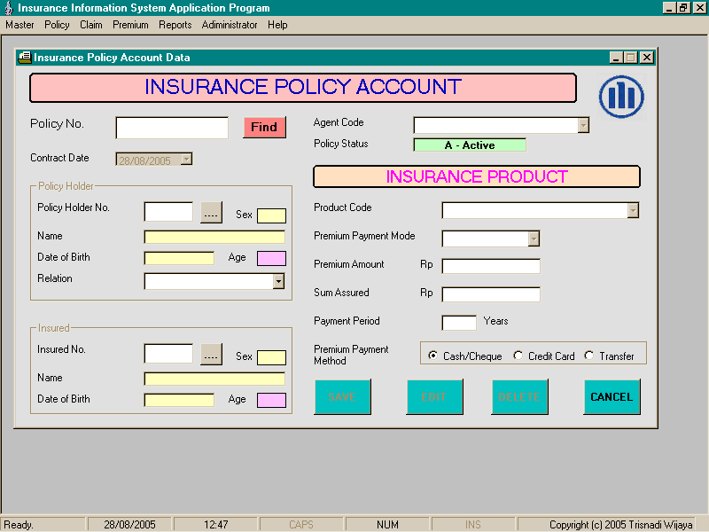



## Insurance Information System

### Description

This is a complete insurance information system application program.

I made this program for my final assignment. I use Visual Basic 6.0 and SQL Server 2000 Personal Edition to make this program.

You can save, edit or delete policyholder data, policy account data, save regular premium payment data and claim data. You also can generate production report and premium payment report.

So i hope this source can help you to understand about insurance information system and to attract Indonesia programmers to develop their programming skills.

I also include data source in MS Access. You can import the data source into your SQL Server.

Enjoy the code. Thank you. :)
 
### More Info
 

             |
---                |---
**Submitted On**   |2005-08-25 12:10:28
**By**             |[Trisnadi Wijaya](https://github.com/Planet-Source-Code/PSCIndex/blob/master/ByAuthor/trisnadi-wijaya.md)
**Level**          |Intermediate
**User Rating**    |4.3 (13 globes from 3 users)
**Compatibility**  |VB 6\.0
**Category**       |[Complete Applications](https://github.com/Planet-Source-Code/PSCIndex/blob/master/ByCategory/complete-applications__1-27.md)
**World**          |[Visual Basic](https://github.com/Planet-Source-Code/PSCIndex/blob/master/ByWorld/visual-basic.md)
**Archive File**   |[Insurance\_1928288282005\.zip](https://github.com/Planet-Source-Code/trisnadi-wijaya-insurance-information-system__1-62221/archive/master.zip)

